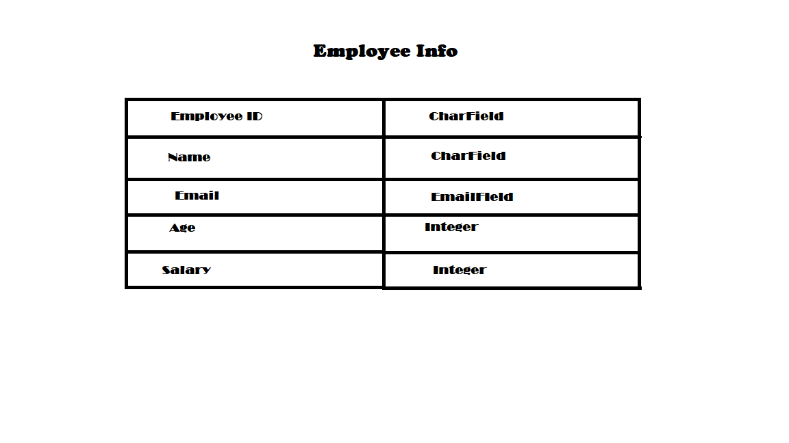
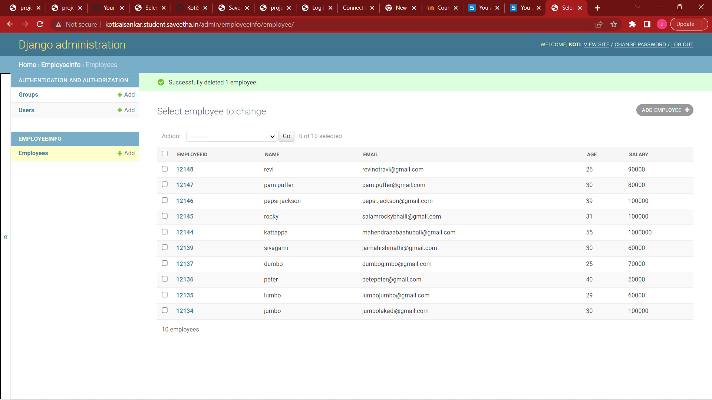

# Django ORM Web Application

## AIM
To develop a Django application to store and retrieve data from a database using Object Relational Mapping(ORM).

## Entity Relationship Diagram



## DESIGN STEPS

### STEP 1:
we have to clone git repository , then we get django-orm-app .By using cd django-orm-app we should enter into it.Then we have to use cd dataproject and enter into it. We have to install our app in settings.py.

### STEP 2:
We have to do startapp employeeinfo in setings.py and we have to go to models.py and enter the code and make a primary key. We have to do makemigrations and migrate the data.
### STEP 3:
Now we have to createsuperuser and enter the details.
Now run the server.

## PROGRAM

```
from django.db import models

# Create your models here.
from django.db import models
from django.contrib import admin
# Create your models here.
class Employee(models.Model):
    employeeid = models.CharField(max_length=8,primary_key=True)
    name =models.CharField(max_length=100)
    age = models.IntegerField()
    email = models.EmailField()
    salary = models.IntegerField()
   
class EmployeeAdmin(admin.ModelAdmin):
    list_display = ('employeeid','name','email','age','salary')

```

## OUTPUT





## RESULT
Successfully Executed.