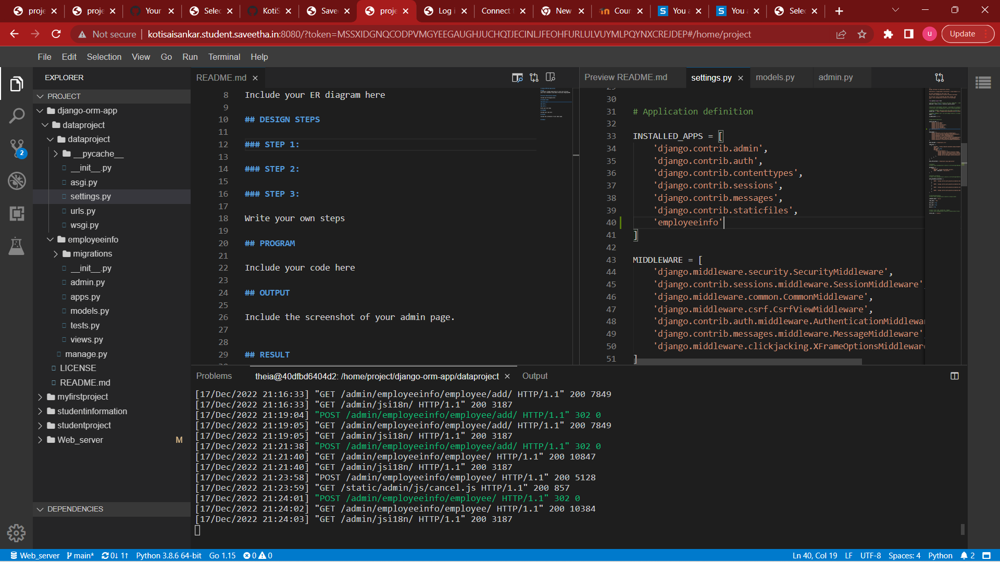

# Django ORM Web Application

## AIM
To develop a Django application to store and retrieve data from a database using Object Relational Mapping(ORM).

## Entity Relationship Diagram

## DESIGN STEPS

### STEP 1:
first we have to clone the reprositry from git then we have to give a command to enter in django-orm-app we have to enter in the file called called dataproject by using command called cd dataproject  

### STEP 2:
now we have to enter in our own created file name marksinfo by using a command called python3 manage.py startapp marksinfo.

### STEP 3:
now we have to copy the theia link and add it in admin paste that in new app to get the output and enter the user name and password and the details ew created in the terminal

Write your own steps

## PROGRAM

Include your code here

## OUTPUT

## RESULT
